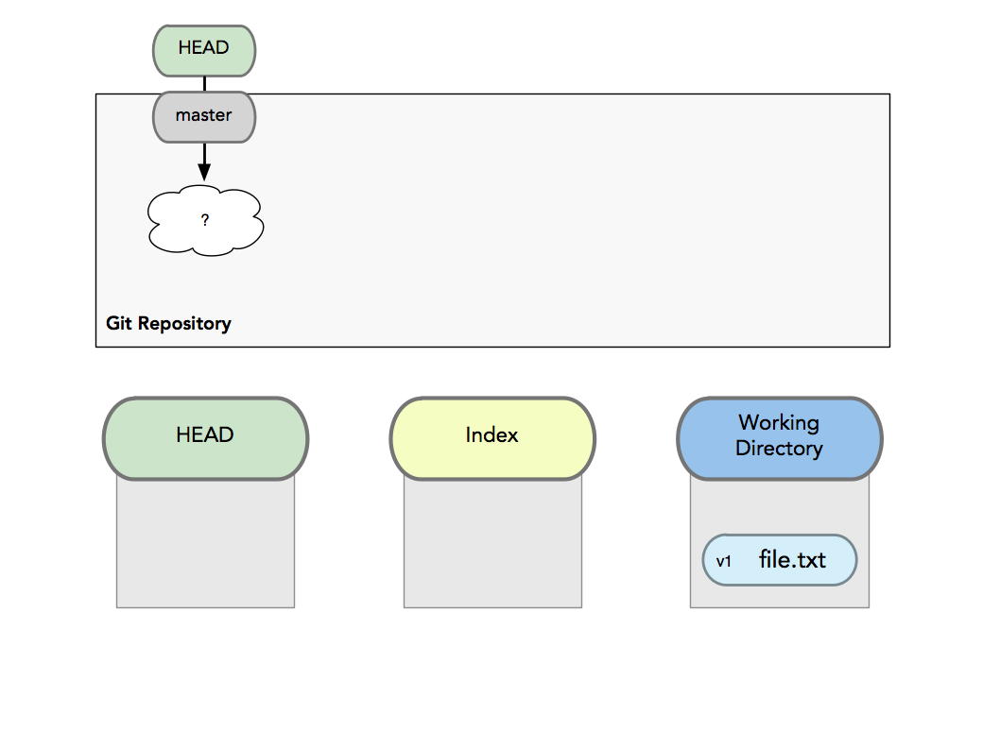
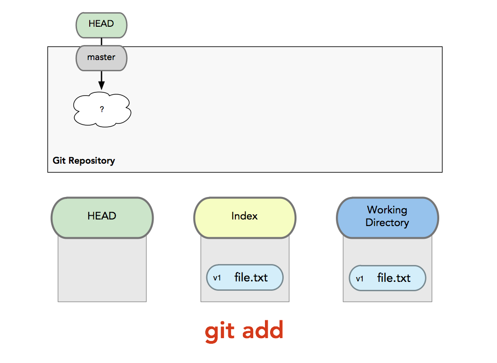
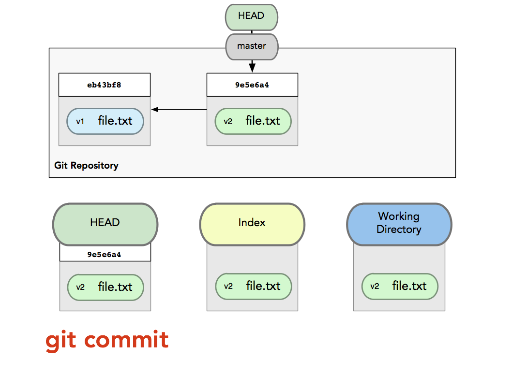
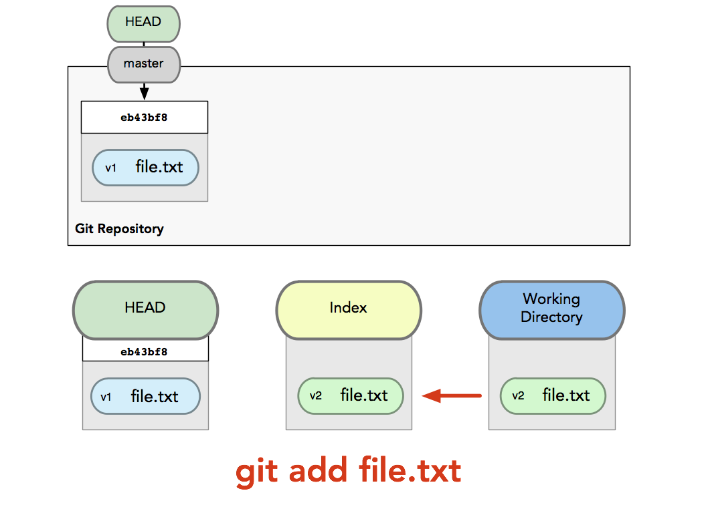
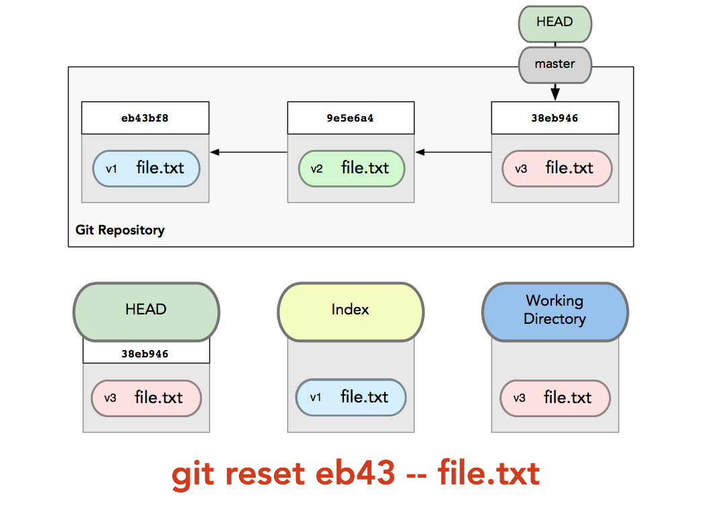
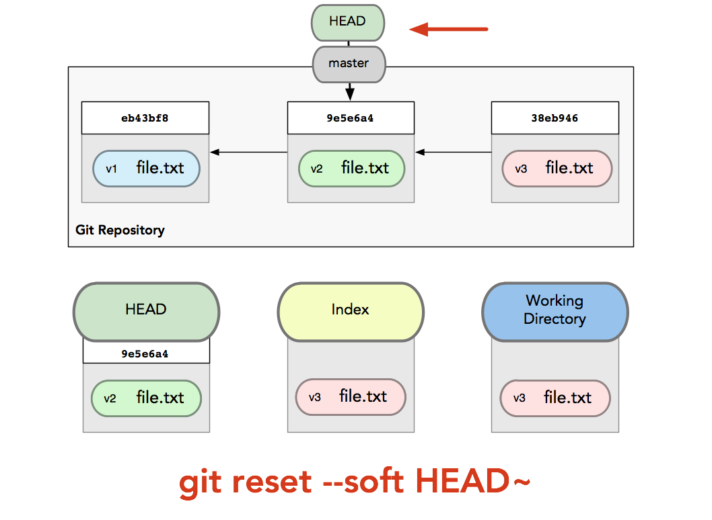
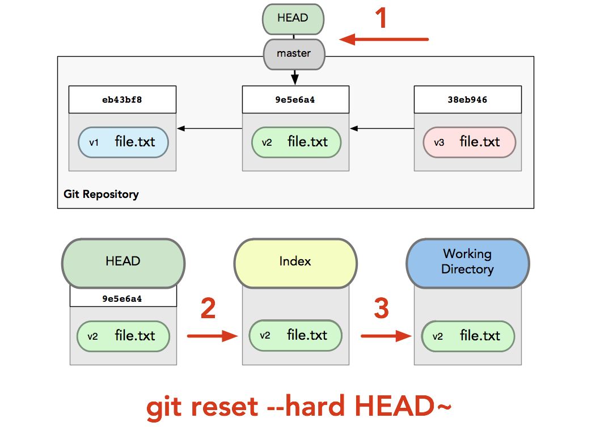
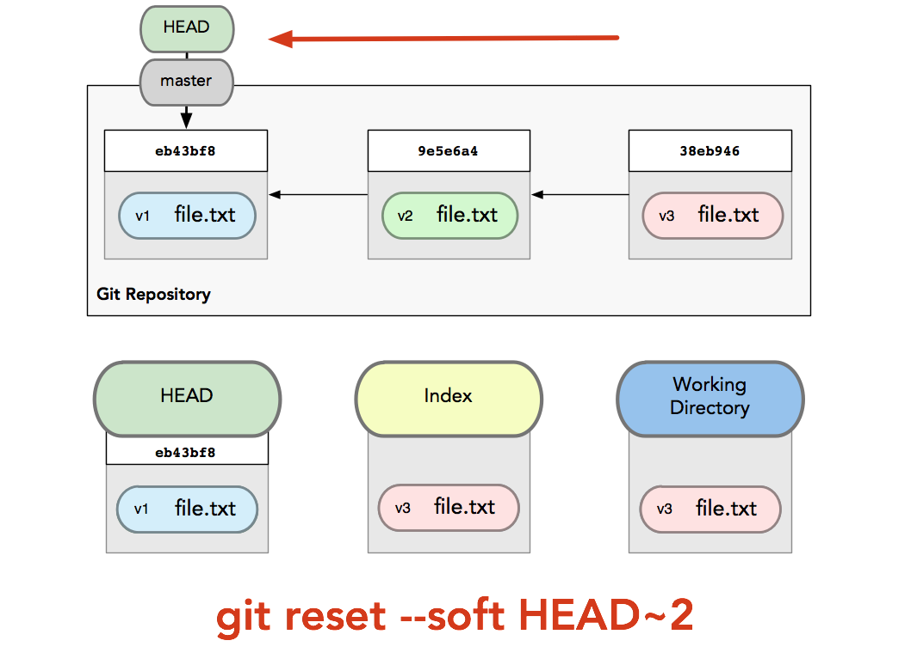
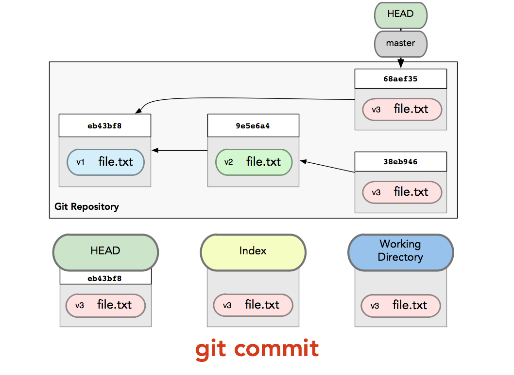
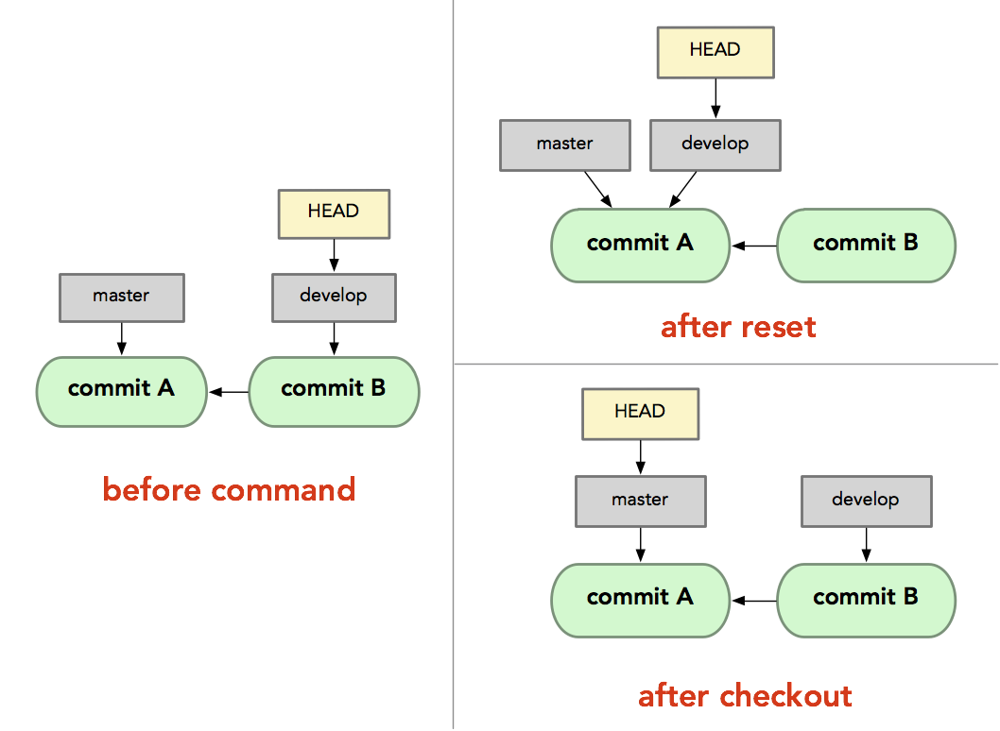

!SLIDE subsec center

# ACT TWO #

## Working With Trees ##

!SLIDE subsec bold

# git status #

!SLIDE example

<pre>
<b>$ git status</b>
# On branch master
# Your branch is behind 'origin/master' by 2 commits,
#  and can be fast-forwarded.
#
# Changes to be committed:
#   (use "git reset HEAD <file>..." to unstage)
#
#       modified:   jobs/email_reply.rb
#
# Changed but not updated:
#   (use "git add <file>..." to update what will be committed)
#   (use "git checkout -- <file>..." to discard changes 
#     in working directory)
#
#       modified:   app/helpers/users_helper.rb
#       modified:   test/unit/email_reply_job_test.rb
#
</pre>

!SLIDE example

<pre>
<b>$ git status</b>
# On branch master
# Your branch is behind 'origin/master' by 2 commits,
#  and can be fast-forwarded.
#
# Changes to be committed:
#   <strong>HEAD and index differ</strong>
#
#       modified:   jobs/email_reply.rb
#
# Changed but not updated:
#   <strong>index and working directory differ</strong>
#
#
#
#       modified:   app/helpers/users_helper.rb
#       modified:   test/unit/email_reply_job_test.rb
#
</pre>

!SLIDE center

!SLIDE center

!SLIDE center

!SLIDE center

!SLIDE center

!SLIDE

<pre>
<b>$ git status</b>
# On branch master
# Your branch is behind 'origin/master' by 2 commits,
#  and can be fast-forwarded.
#
# Changed but not updated:
#   (use "git add <file>..." to update what will be committed)
#   (use "git checkout -- <file>..." to discard changes 
#     in working directory)
#
#       modified:   file.txt
#
</pre>

!SLIDE center

!SLIDE center

!SLIDE

<pre>
<b>$ git status</b>
# On branch master
# Your branch is behind 'origin/master' by 2 commits,
#  and can be fast-forwarded.
#
# Changes to be committed:
#   (use "git reset HEAD <file>..." to unstage)
#
#       modified:   file.txt
#
</pre>

!SLIDE center

!SLIDE center

!SLIDE subsec bold

# git reset #

!SLIDE subsec

# 2 forms #

!SLIDE code smaller

# git reset [commit] [path] #

# git reset [commit] #

!SLIDE code

# 1. Path Form #

## git reset [commit] [path] ##

!SLIDE

## `git reset [file]` ##

# is the opposite of #

## `git add [file]` ##

!SLIDE

!SLIDE

!SLIDE

# Reset to   an older file #

!SLIDE

!SLIDE

!SLIDE

<pre>
<b>$ git status</b>
# On branch master
# Changes to be committed:
#   (use "git reset HEAD <file>..." to unstage)
#
#       modified:   file.txt
#
# Changed but not updated:
#   (use "git add <file>..." to update what will be committed)
#   (use "git checkout -- <file>..." to discard changes in working directory)
#
#       modified:   file.txt
#
</pre>

!SLIDE code

# 2. Commit Form #

## git reset [commit] ##

!SLIDE bullets list incremental

# Reset Options #

* **--soft** move HEAD to target
* **[--mixed]** then copy to index
* **--hard** then copy to work dir

!SLIDE title

# --soft #

## move HEAD to another commit ##

!SLIDE center

!SLIDE center

!SLIDE title

# --mixed #

## move HEAD to another commit, then copy into index ##

!SLIDE center

!SLIDE center

!SLIDE title

# --hard #

## move HEAD, copy to index, copy to working directory ##

!SLIDE center

!SLIDE center

!SLIDE

# WTFWIEWTUT #
### whythefuckwouldieverwanttousethis ###

!SLIDE

# unstaging changes #

!SLIDE code

## git reset HEAD -- file ##

!SLIDE

!SLIDE

# undo last commit #

!SLIDE smaller

# `git reset [--mixed] HEAD~` #

## moves HEAD back and moves index back ##

!SLIDE

!SLIDE

!SLIDE

# squash the last 2 commits into one #

!SLIDE small

# git reset --soft HEAD~2 #
# git commit #

## moves HEAD back, keeps index ##

!SLIDE

!SLIDE

!SLIDE

!SLIDE

# &lt;/reset>

!SLIDE center

!SLIDE subsec bold

# git checkout #

!SLIDE subsec

# just a bit outside #
### tried the corner and missed ###

!SLIDE subsec

# 2 forms #

!SLIDE code smaller

# git checkout [commit] [path] #

# git checkout [commit] #

!SLIDE center

!SLIDE center

# Reset v. Checkout #

<table class="rdata">
  <tr>
    <th></th>
    <th>HEAD</th>
    <th>Index</th>
    <th>Work Dir</th>
    <th>WD Safe</th>
  </tr>
  <tr class="level">
    <th>Commit Level</th>
    <td colspan="4">&nbsp;</th>
  </tr>
  <tr class="even">
    <th class="cmd">reset --soft [commit]</th>
    <td class="yes">REF</td>
    <td class="no">NO</td>
    <td class="no">NO</td>
    <td class="yes-wd">YES</td>
  </tr>
  <tr class="odd">
    <th class="cmd">reset [commit]</th>
    <td class="yes">REF</td>
    <td class="yes">YES</td>
    <td class="no">NO</td>
    <td class="yes-wd">YES</td>
  </tr>
  <tr class="even">
    <th class="cmd">reset --hard [commit]</th>
    <td class="yes">REF</td>
    <td class="yes">YES</td>
    <td class="yes">YES</td>
    <td class="no-wd">NO</td>
  </tr>
  <tr class="odd">
    <th class="cmd">checkout [commit]</th>
    <td class="yes">HEAD</td>
    <td class="yes">YES</td>
    <td class="yes">YES</td>
    <td class="yes-wd">YES</td>
  </tr>
  <tr class="level">
    <th>File Level</th>
    <td colspan="4">&nbsp;</th>
  </tr>
  <tr class="even">
    <th class="cmd">reset (commit) [file]</th>
    <td class="no">NO</td>
    <td class="yes">YES</td>
    <td class="no">NO</td>
    <td class="yes-wd">YES</td>
  </tr>
  <tr class="odd">
    <th class="cmd">checkout (commit) [file]</th>
    <td class="no">NO</td>
    <td class="yes">YES</td>
    <td class="yes">YES</td>
    <td class="no-wd">NO</td>
  </tr>
</table>

